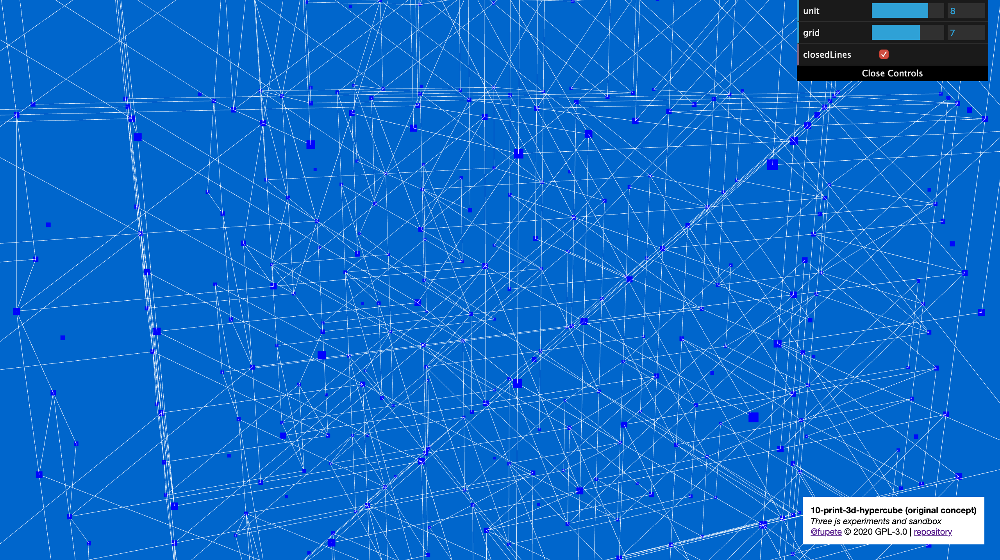
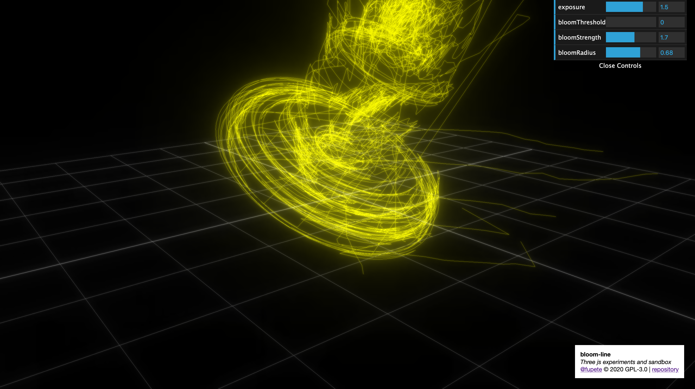
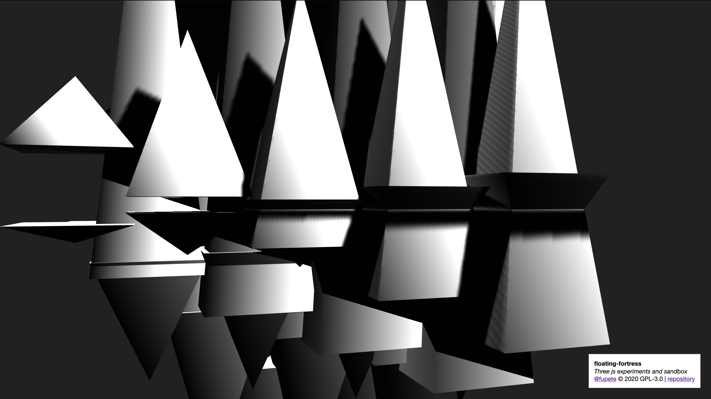

```
//   _____ _____ _____  
//  |   __|  |  |  _  |    
//  |   __|  |  |   __|  
//  |__|  |_____|__|     
//   _____ _____ _____  
//  |   __|_   _|   __|  
//  |   __| | | |   __|  
//  |_____| |_| |_____|    
//                       
// Daniele Tabellini @fupete © 2020 GNU General Public License v3.0
// lets-do-some-3d _ github repository
// Three js experiments and sandbox
//
```
-----

[Github Repository](https://github.com/Fupete/lets-do-some-3d) | [Website](https://fupete.github.io/lets-do-some-3d/) | [License](https://github.com/Fupete/lets-do-some-3d/blob/master/LICENSE)

-----

#### 2019
_Reverse order_

[10-print-3d-hypercube](./10-print-3d-hypercube)


[bloom-line](./bloom-line)


[floating-fortress](./floating-fortress)


[floating-obelisk](./floating-obelisk)


[astro-nascente](./astro-nascente)


[giant-s-causeway-island](./giant-s-causeway-island)


[giant-s-causeway-concept](./giant-s-causeway-concept)


[archived-first-tests/03-basic-template-effect-ascii](./archived-first-tests/03-basic-template-effect-ascii)


[archived-first-tests/02-basic-template-effect-raycasting](./archived-first-tests/02-basic-template-raycasting)


[archived-first-tests/01-basic-template](./archived-first-tests/01-basic-template)


------

### Memo lists

#### _Ideas I want to explore, eventually ;-)_

##### New ones to explore
- Character design/control for my "art puppets"
- Machine learning and three js?
- Responsive UI opportunities
- Physical dataviz

##### Porting opportunities
- Solid gradients/shapes, studies for Lcd Firenze, porting from Processing 3.0
- Geo/Dataviz by me and Davide Onestini 2018, porting from Processing 3.0
- Revolve experiments by me and Andrea Nico 2017, porting from Processing 3.0
- Hate words are viruses 2016, Twitter visualizer for hate speech, by me and MCSotgiu, porting from Processing 3.0
- My Fury 3D performative 3d drawing app 2016, porting from Processing 3.0


#### _Links and resources I want to check, eventually ;-)_

##### Read
- http://acko.net/tv/webglmath/
- http://acko.net/blog/on-webgl/
- suggestions?

##### Watch/Study/Hack
- [https://threejsfundamentals.org/](https://threejsfundamentals.org/)
- [https://discoverthreejs.com/](https://discoverthreejs.com/)
- [https://reactjsexample.com/react-fiber-renderer-for-three-js/](https://reactjsexample.com/react-fiber-renderer-for-three-js/)
- [https://dustinpfister.github.io/2018/04/19/threejs-line/](https://dustinpfister.github.io/2018/04/19/threejs-line/)
- [https://tympanus.net/codrops/2019/04/10/how-to-create-a-sticky-image-effect-with-three-js/](https://tympanus.net/codrops/2019/04/10/how-to-create-a-sticky-image-effect-with-three-js/)
- [https://codepen.io/vcomics/pen/KBMyjE](https://codepen.io/vcomics/pen/KBMyjE)
- [https://codepen.io/clockmaker/pen/gpozrX](https://codepen.io/clockmaker/pen/gpozrX)
- [https://codepen.io/zadvorsky/pen/vNVNYr](https://codepen.io/zadvorsky/pen/vNVNYr)
- suggestions?

------

_Work in progress_
