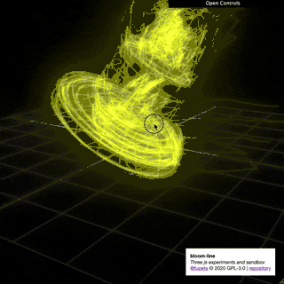

```
//   _____ _____ _____  
//  /   __/  /  /  _  /    
//  /   __/  /  /   __/  
//  /__/  /_____/__/     
//   _____ _____ _____  
//  /   __/_   _/   __/  
//  /   __/ / / /   __/  
//  /_____/ /_/ /_____/    
//                       
// Daniele Tabellini @fupete © 2020 GNU General Public License v3.0
// lets-do-some-3d _ github repository
// Three js & webgl experiments and sandbox
//
```
-----

[Github Repository](https://github.com/Fupete/lets-do-some-3d) / [Website](https://fupete.github.io/lets-do-some-3d/) / [License](https://github.com/Fupete/lets-do-some-3d/blob/master/LICENSE)

-----

## 2020
_I know I know, soon more_

**[noise-bubbles-borg &rarr;](./noise-bubbles-borg)**


-----

## 2019
_Reverse order_

**[10-print-3d-hypercube &rarr;](./10-print-3d-hypercube)**

Do you know the famous oneliner "10 Print" for Commodore 64? And [the incredible book](https://10print.org/) about it by [Nick Monfort](https://nickm.com/) & friends? Yeah, I use it and abuse it the 1st day of each semester at my interaction design lab @unirsm since day one. Recently I started to imagine it in 3D, a complex hypercube, like a VR board game for _trekkers_. Well, this is the 1st experiment in that direction.

 


**[bloom-line &rarr;](./bloom-line)**

 


**[floating-fortress &rarr;](./floating-fortress)**

 

**[floating-obelisk &rarr;](./floating-obelisk)**

 

**[astro-nascente &rarr;](./astro-nascente)**

I have always want to give physical dimensions and form to our art drawings and allucinations at  [Teller&k](https://tellerk.com/drawings). Here my astro-ship called "morning star"... that's the way, i like it.


**[giant-s-causeway-island &rarr;](./giant-s-causeway-island)**

A demo for [@iretrtr](https://iretrtr.github.io/)'s Master Thesis in Design "[Digital cartography and ethnographic survey of online communities.](https://github.com/iretrtr/online-community-maps)"


**[giant-s-causeway-concept &rarr;](./giant-s-causeway-concept)**


**[archived-first-tests/03-basic-template-effect-ascii &rarr;](./archived-first-tests/03-basic-template-effect-ascii)**


**[archived-first-tests/02-basic-template-raycasting &rarr;](./archived-first-tests/02-basic-template-raycasting)**


**[archived-first-tests/01-basic-template &rarr;](./archived-first-tests/01-basic-template)**


------

### Memo lists

#### _Ideas I want to explore, eventually ;-)_

##### New ones to explore
- Leapmotion and Threejs, what could be so damn different from programming in Processing three years ago... update / found: [http://jaanga.github.io/gestification-r3/](http://jaanga.github.io/gestification-r3/)
- Character design/control for our [Teller&k](https://tellerk.com)'s' "art puppets" and drawings... Do I need Blender too? Yeah. update / found: interesting stuff about _grease pencil_ [https://twitter.com/dedouze_/status/1250124156802404355](https://twitter.com/dedouze_/status/1250124156802404355) [https://twitter.com/_pepeland_/status/1250146895957237761](https://twitter.com/_pepeland_/status/1250146895957237761)
- Machine learning and three js?
- Responsive touchable UI opportunities... Oh I would love to see them
- Physical VR/AR dataviz? / [the magical Dataphys list](http://dataphys.org/list/) / Can u imagine?

##### Porting opportunities, ready to be approached
- "Solid gradients/shapes", studies for Lcd Firenze, porting from Processing 3.0 / Yet to publish / GPL 3.0 License?  
- "Geo/World dataviz of human rights", by me and Davide Onestini 2018, porting from Processing 3.0 / [Davide's concept](https://github.com/dsii-2017-unirsm/dsii-2017-archive/tree/master/davideonestini/making-visible) / [My OOP release with UI](https://github.com/dsii-2018-unirsm/archive/tree/master/2018/openday/opendayP3dOOP) / MIT License
- "Revolve experiments" by me and Andrea Nico 2017, porting from Processing 3.0 / MIT License
- "Hate words are viruses" 2016, Twitter visualizer for hate speech, by me and MCSotgiu, porting from Processing 3.0 / [MCSotgiu's concept](https://github.com/dsii-2016-unirsm/dsii-2016-archive/tree/master/MCSotgiu/Making-Visible) / MIT License
- My "Fury 3D" performative 3d Leapmotion drawing app 2016, porting from Processing 3.0 / Yet to publish / GPL 3.0 License?


#### _Links and resources I want to check, eventually ;-)_

##### Read
- [http://acko.net/tv/webglmath/](http://acko.net/tv/webglmath/)
- [http://acko.net/blog/on-webgl/](http://acko.net/blog/on-webgl/)
- suggestions?

##### Watch/Study/Hack
- [https://webglfundamentals.org/](https://webglfundamentals.org/)
- [https://webgl2fundamentals.org/](https://webgl2fundamentals.org/)
- [https://threejsfundamentals.org/](https://threejsfundamentals.org/)
- [https://discoverthreejs.com/](https://discoverthreejs.com/)
- [https://reactjsexample.com/react-fiber-renderer-for-three-js/](https://reactjsexample.com/react-fiber-renderer-for-three-js/)
- [https://dustinpfister.github.io/2018/04/19/threejs-line/](https://dustinpfister.github.io/2018/04/19/threejs-line/)
- [https://tympanus.net/codrops/2019/04/10/how-to-create-a-sticky-image-effect-with-three-js/](https://tympanus.net/codrops/2019/04/10/how-to-create-a-sticky-image-effect-with-three-js/)
- [https://codepen.io/vcomics/pen/KBMyjE](https://codepen.io/vcomics/pen/KBMyjE)
- [https://codepen.io/clockmaker/pen/gpozrX](https://codepen.io/clockmaker/pen/gpozrX)
- [https://codepen.io/zadvorsky/pen/vNVNYr](https://codepen.io/zadvorsky/pen/vNVNYr)
- [https://github.com/sneha-belkhale/AI4Animation-js](https://github.com/sneha-belkhale/AI4Animation-js)
- [https://medium.com/huia/creating-an-interactive-artificial-intelligence-experience-in-the-browser-with-tensorflowjs-ea205ee08c02](https://medium.com/huia/creating-an-interactive-artificial-intelligence-experience-in-the-browser-with-tensorflowjs-ea205ee08c02)
- [https://github.com/nudibranchrecords/hedron](https://github.com/nudibranchrecords/hedron)
- suggestions?

##### Physics engines for three.js
- [https://discourse.threejs.org/t/preferred-physics-engine-cannon-js-ammo-js-diy/1565/10](https://discourse.threejs.org/t/preferred-physics-engine-cannon-js-ammo-js-diy/1565/10)
- [https://github.com/Aqro/Physics-menu-threejs-cannonjs](https://github.com/Aqro/Physics-menu-threejs-cannonjs)
- suggestions?

------

_Work in progress / Follow me on [@fupete](https://twitter.com/fupete)
